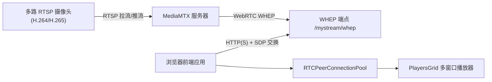
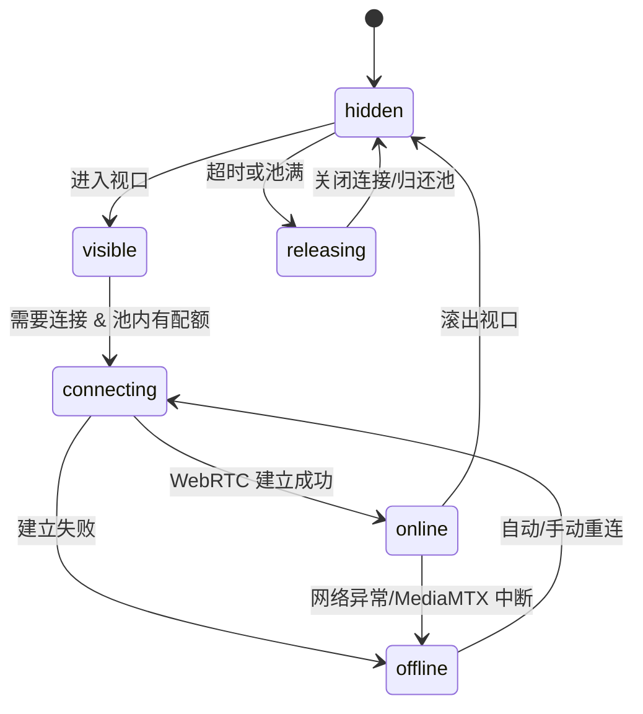

# MediaMTX + WebRTC 多窗口摄像头播放器开发技术文档

## 1. 项目背景与目标

本项目是一个 **基于 MediaMTX + WebRTC 的多窗口摄像头播放器**，用于在浏览器中低延迟地查看多路 RTSP 摄像头（H.264/H.265 编码，经 MediaMTX 转换为 WebRTC 流）。

核心目标：

- **多窗口并行播放多路摄像头流**。
- **端到端低延迟（目标 < 300ms）**，适用于安防监控、实验观测等近实时场景。
- **纯前端实现，本地运行**，只依赖外部 MediaMTX 实例作为流媒体服务器和协议网关。
- 满足以下 11 项核心特性（下文逐条设计与说明）。

技术选型：

- **MediaMTX**：统一接入 RTSP 摄像头流，转发为 WebRTC（WHEP）端点，屏蔽底层 RTP/RTSP/编解码细节。
- **WebRTC（WHEP）**：提供浏览器端低延迟播放能力。
- **纯前端架构**：`index.html + JS 模块 + CSS`，可放在任意静态资源服务器（如 `serve`、nginx）上运行。

参考资料：

- MediaMTX 官方文档（特别是 WebRTC / WHEP 相关章节）。
- MDN WebRTC API 文档，尤其是 `RTCPeerConnection`、`MediaStream`、`getStats()` 等接口。

---

## 2. 总体架构与数据流

### 2.1 系统架构概览

整体数据流：

1. 多路 **RTSP 摄像头（H.264/H.265 编码）** 向 MediaMTX 推流或由 MediaMTX 主动拉流。
2. MediaMTX 将每路 RTSP 流暴露为 **WebRTC WHEP 端点**，例如：
   - RTSP 源：`rtsp://cam1/...` → MediaMTX 内部路径：`cam1`。
   - WHEP 端点：`http://mediamtx-ip:8889/cam1/whep`。
3. 浏览器前端通过 `RTCPeerConnection` + WHEP HTTP POST/SDP 交换，与 MediaMTX 建立 WebRTC 连接，并将 `MediaStream` 绑定到 `<video>` 元素上播放。
4. 前端根据可见性和连接池策略管理连接生命周期，实现懒加载与资源复用。

### 2.2 Mermaid 架构图



说明：

- 多个摄像头路径（如 `cam1`、`cam2`）在 MediaMTX 内映射为多个 WHEP 端点。
- 前端通过配置摄像头列表（名称、路径）拼出对应 WHEP URL，并从连接池为每一路创建或复用 `RTCPeerConnection`。

### 2.3 前端模块划分

建议的前端模块：

- `camera-manager`：摄像头配置管理（增删改查、持久化）。
- `webrtc-pool`：`RTCPeerConnection` 连接池管理与复用策略。
- `player`：单路摄像头播放器组件（DOM 结构、状态展示、截图、全屏、重连、性能统计）。
- `visibility`：基于 `IntersectionObserver` 的懒加载管理。
- `stats`：调用 `RTCPeerConnection.getStats()` 采集延迟、帧率、丢包率等性能指标。
- `screenshot`：单路及批量截图、统一时间戳生成与文件名/路径格式化。
- `layout`：多窗口 grid 布局与全屏切换逻辑。

---

## 3. 核心特性与实现设计（逐条）

### 3.1 多窗口并行播放多路摄像头流

**需求**：在一个页面中并行展示多路摄像头流，每路独立控制（状态、截图、重连等）。

**数据结构建议**：

```js
// 运行期摄像头配置
const cameraConfig = {
  id: "cam1",          // 可选，内部唯一 ID
  name: "大门口",        // 显示名称
  path: "cam1",        // 与 MediaMTX 内路径一致
  rtspUrl: "",         // 可选，仅用于后台生成 mediamtx.yml
};

// 运行期配置
const appSettings = {
  webrtcBase: "http://localhost:8889", // MediaMTX WebRTC 基础地址
  cameras: [cameraConfig, ...],
  gridColumns: 3,                       // 每行列数
};
```

**DOM 结构与布局**：

- 页面包含一个 `.grid` 容器（如 `#playersGrid`），使用 CSS Grid：
  - `grid-template-columns: repeat(N, minmax(0, 1fr));`，`N` 由 `gridColumns` 控制。
- 每路摄像头对应一个 **播放器卡片**：标题栏 + 视频区域 + 底部控制区。

**播放器实例生命周期**：

- 初始化：
  - 从 `cameraConfig` 列表创建对应数量的 `Player` 实例。
  - 每个实例持有该路的 `RTCPeerConnection` 引用（可能来自连接池）。
- 销毁：
  - 页面切换或重新应用配置时，调用 `player.destroy()`，释放连接、停止统计、移除 DOM。

### 3.2 断连自动重连 + 手动重连

**状态机设计**：

- `idle`：未尝试连接。
- `connecting`：正在建立 WebRTC 连接。
- `online`：连接成功、正常播放。
- `offline`：连接失败或断开，等待自动重连或用户手动重连。
- `not_ready`：后端流未就绪或编码不支持（需用户排查）。

**WebRTC 事件监听**：

- 使用 `pc.onconnectionstatechange` 监听连接状态：
  - `connected` → 设置为 `online`，重置重连计数。
  - `failed` / `disconnected` → 设置为 `offline`，触发自动重连。

**自动重连策略**：

- 为每个播放器维护 `reconnectAttempts` 与 `reconnectTimer`：
  - 失败后按次数增加等待时间（如 `3s + attempts * 2s`，上限 20~30s）。
  - 可根据 HTTP 状态区分不同错误：
    - 400 + `codecs not supported` → 编码问题（`not_ready`，延时更长或暂停重连）。
    - 404 → RTSP 未接通或路径未推流，可间隔 8~30s 重试。
    - 其他网络错误 → 常规自动重连。

**手动重连**：

- 在播放器底部提供「重连」按钮，点击后：
  - 清除自动重连计时器。
  - 主动调用 `connect()` 再次建立连接。

### 3.3 双击单路窗口应用内全屏切换

**目标**：

- 双击某路视频区域，在应用内将该路视频以近似「全屏」方式展示，再次双击或按 ESC 退出。
- 避免依赖浏览器原生全屏权限弹窗，主要通过 CSS + DOM 控制实现「应用内全屏」。

**实现思路**：

- 为每个播放器卡片增加一个「全屏容器」类，如 `.player-card.fullscreen-mode`：
  - 使用固定定位 `position: fixed; inset: 0; z-index` 置于最上层。
  - 隐藏其他卡片或将其置于背后（如在外层包一层全屏遮罩）。
- 在视频容器上监听 `dblclick` 事件，触发 `toggleFullscreenInApp()`：
  - 若当前无全屏卡片，则为当前卡片添加 `.fullscreen-mode` 类并记录当前全屏实例。
  - 若已有全屏，则移除该类并恢复正常布局。
- 可选：保留浏览器原生全屏（`document.documentElement.requestFullscreen()`）作为增强模式，使用按钮触发。

### 3.4 连接状态可视化展示

**状态定义**：

- `connecting`：浅黄色或蓝色点 + 文案「连接中…」。
- `online`：绿色点 + 文案「已连接」。
- `offline`：灰色或红色点 + 文案「断开」。
- `not_ready`：橙色点 + 文案「流未就绪 / 编码不支持」。

**UI 建议**：

- 在播放器头部右侧放一个状态区域：
  - `●` 状态小圆点（使用 CSS 背景色）。
  - 文案 + Tooltip 说明（如编码不支持时给出 H.265 在浏览器不兼容的原因，建议使用 H.264）。

**与状态机绑定**：

- 在播放器内部封装 `setStatus(state, subText)`，统一更新 DOM 状态类与文案：
  - 切换类名（如 `.online`、`.offline` 等）以驱动样式变化。

### 3.5 低延迟（WebRTC，延迟 < 300ms）

**方案说明**：

- 采用 MediaMTX 的 WebRTC/WHEP 输出，避免 HLS 等高延迟协议。
- 使用 `RTCPeerConnection` 点对点传输媒体，利用 UDP 及自适应拥塞控制，天然低延迟。

**配置与实践建议**：

- MediaMTX 端：
  - 为公网或复杂网络环境配置 `webrtcAdditionalHosts`、`webrtcLocalUDPAddress` / `webrtcLocalTCPAddress`、`webrtcICEServers2` 等，以提高握手成功率。
  - 推荐将摄像头流转为 **H.264 + Opus**，兼容性最佳（参考官方 `ffmpeg` 示例）。
- 前端：
  - 视频元素使用 `playsInline`、`autoplay`，避免多余缓冲。
  - 避免在同一页面中插入大量 DOM 或阻塞脚本，保持主线程轻量。
  - 性能监控模块中记录实际端到端延迟，若超出目标，则在文档中给出排查建议（摄像头端缓冲、转码、网络抖动等）。

### 3.6 本地运行纯前端

**运行模式**：

- 前端项目为 **静态站点**，可以通过：
  - `npm install --save-dev serve`，然后 `npx serve . -p 8000` 启动开发服务器。
  - 或使用 nginx / 其它 HTTP 静态服务。
- MediaMTX 独立运行，常见方式：
  - 本地二进制或 Docker（在文档中给出简要参考命令即可）。

**配置约定**：

- 在前端设置中允许用户填入 `webrtcBase`：
  - 示例：`http://localhost:8889`。
  - 实际 WHEP URL = `webrtcBase + '/' + camera.path + '/whep'`。

**浏览器环境限制**：

- 纯前端无法直接写本地任意目录，只能：
  - 使用 `<a download>` 触发下载（文件保存到浏览器下载目录）。
  - 使用 File System Access API（需用户授权目录，浏览器支持度有限），可以封装在高级模式下使用。
- 文档中要明确说明：
  - **路径格式主要体现在文件名结构上**，真实的物理目录由操作系统下载目录 + 浏览器决定。

### 3.7 批量截图：统一时间戳与路径格式

**需求细化**：

1. **一键截图所有摄像头**：用户点击一次，全页面所有「当前已连接」的摄像头各截一张图。
2. **统一时间戳**：本次批量截图内所有图片使用同一个全局时间戳，避免在秒数进位时出现跨多个日期/时间目录的情况。
3. **自定义保存文件路径格式**：
   - 逻辑路径格式：`父目录/YYYY-MM-DD/HH-MM-SS/摄像头名称_时间戳.png`。
   - 示例：`captures/2026-03-13/14-05-29/大门口_1710329129000.png`。

**统一时间戳生成方案**：

- 批量截图入口函数中一次性生成：

```js
async function batchScreenshot(players) {
  if (!players.length) return;
  const batchTs = Date.now(); // 全局时间戳
  let success = 0;
  for (const p of players) {
    if (!p.isConnected) continue;
    await p.singleScreenshot(batchTs);
    success += 1;
    await new Promise((r) => setTimeout(r, 300)); // 适度间隔，避免主线程卡顿
  }
  console.log(`已完成 ${success} 路截图，批次时间戳: ${batchTs}`);
}
```

- 单路截图中不再调用 `Date.now()`，而是使用传入的 `batchTs`。

**路径格式实现**：

- 定义一个时间格式化工具：

```js
function formatTimestamp(ts) {
  const d = new Date(ts);
  const pad = (n) => String(n).padStart(2, "0");
  const yyyy = d.getFullYear();
  const mm = pad(d.getMonth() + 1);
  const dd = pad(d.getDate());
  const hh = pad(d.getHours());
  const mi = pad(d.getMinutes());
  const ss = pad(d.getSeconds());
  return {
    date: `${yyyy}-${mm}-${dd}`,
    time: `${hh}-${mi}-${ss}`,
  };
}
```

- 单路截图逻辑：

```js
async function singleScreenshotImpl(camera, videoEl, batchTs) {
  const ts = batchTs || Date.now();
  const { date, time } = formatTimestamp(ts);
  const canvas = document.createElement("canvas");
  canvas.width = videoEl.videoWidth;
  canvas.height = videoEl.videoHeight;
  const ctx = canvas.getContext("2d");
  ctx.drawImage(videoEl, 0, 0, canvas.width, canvas.height);
  const dataUrl = canvas.toDataURL("image/png");

  const logicalDir = `${date}/${time}`; // 对应 YYYY-MM-DD/HH-MM-SS
  const fileName = `${camera.name}_${ts}.png`;
  const logicalPath = `${logicalDir}/${fileName}`;

  // 浏览器环境下，将 logicalPath 作为下载文件名
  triggerDownload(logicalPath, dataUrl);
}
```

- `triggerDownload` 可通过创建 `<a>` 元素并设置 `download` 属性，让用户在下载目录看到「日期/时间/摄像头名称_时间戳」结构的文件名。

**高级模式（可选）**：

- 若使用 File System Access API，可在文档中说明：
  - 用户先选择父目录，然后代码中按 `YYYY-MM-DD/HH-MM-SS/` 创建子目录并写入 PNG 文件。

### 3.8 摄像头管理面板：动态增删摄像头

**UI 需求**：

- 提供一个「设置」面板（弹窗/侧边栏），支持：
  - 新增摄像头（名称 + 流路径/ID + 可选 RTSP URL 字段）。
  - 删除已有摄像头。
  - 配置 `webrtcBase`、`gridColumns` 等全局设置。

**数据持久化**：

- 使用 `localStorage` 存储配置：

```js
const STORAGE_KEY = "mediamtx-webrtc-player-settings";

function loadSettings() {
  const raw = localStorage.getItem(STORAGE_KEY);
  if (!raw) return getDefaultSettings();
  try {
    return { ...getDefaultSettings(), ...JSON.parse(raw) };
  } catch {
    return getDefaultSettings();
  }
}

function saveSettings(settings) {
  localStorage.setItem(STORAGE_KEY, JSON.stringify(settings));
}
```

**与播放器联动**：

- 保存设置后：
  - 重新初始化播放器网格：销毁旧实例 → 根据新摄像头列表创建新实例。
  - 可考虑保留当前连接状态（如仅对子集进行增删），但第一版可以简单全量重建。

### 3.9 性能监控：延迟、帧率、丢包率

**数据来源**：

- 使用 `RTCPeerConnection.getStats()` 周期性（如每 2s）获取统计信息。
- 针对每个 `RTCPeerConnection`：
  - 找到 `type === "inbound-rtp" && kind === "video"` 的报告项。

**字段示例**：

- `packetsLost`：丢失的 RTP 包数。
- `packetsReceived`：收到的 RTP 包数。
- `framesPerSecond` 或 `framesDecoded`：可推算当前帧率。
- `jitter`、`roundTripTime` 等：可用于估算抖动与 RTT。

**示例逻辑（伪代码）**：

```js
async function collectStatsForPlayer(pc, prevStats) {
  const report = await pc.getStats();
  let videoInbound = null;
  report.forEach((stat) => {
    if (stat.type === "inbound-rtp" && stat.kind === "video") {
      videoInbound = stat;
    }
  });
  if (!videoInbound) return null;

  const now = performance.now();
  const prev = prevStats?.raw;

  let fps = videoInbound.framesPerSecond;
  if (!fps && prev && prev.framesDecoded != null && videoInbound.framesDecoded != null) {
    const deltaFrames = videoInbound.framesDecoded - prev.framesDecoded;
    const deltaTime = (now - prevStats.timestamp) / 1000;
    fps = deltaTime > 0 ? deltaFrames / deltaTime : 0;
  }

  const packetsLost = videoInbound.packetsLost || 0;
  const packetsReceived = videoInbound.packetsReceived || 0;
  const totalPackets = packetsLost + packetsReceived;
  const lossRate = totalPackets > 0 ? packetsLost / totalPackets : 0;

  return {
    fps,
    lossRate,
    jitter: videoInbound.jitter,
    rtt: videoInbound.roundTripTime,
    raw: videoInbound,
    timestamp: now,
  };
}
```

**UI 展示**：

- 在每个播放器卡片内，底部或右上角显示一块小状态文本：
  - `FPS: 29.7`  `Loss: 0.3%`  `RTT: 40ms`。
- 更新频率 1~2s 一次，避免频繁重绘。

### 3.10 懒加载：基于可视区域的连接管理

**目标**：

- 非可视区域的摄像头不占用 WebRTC 连接和解码资源。
- 滚动到可视区域时再建立连接；离开可视区域一段时间后可自动断开或降级。

**技术方案**：

- 使用 `IntersectionObserver` 监听每个播放器卡片容器：

```js
const observer = new IntersectionObserver((entries) => {
  for (const entry of entries) {
    const player = entry.target.__playerInstance; // 由初始化时挂载
    if (!player) continue;
    if (entry.isIntersecting) {
      player.onVisible();
    } else {
      player.onHidden();
    }
  }
}, {
  root: null,
  rootMargin: "200px", // 提前 200px 预加载
  threshold: 0.1,
});

// 初始化时观察
observer.observe(playerCardElement);
```

**播放器可见性回调**：

- `onVisible()`：
  - 若当前未连接且条件允许（连接池未达上限），则从连接池获取或新建连接，调用 `connect()`。
- `onHidden()`：
  - 根据策略选择：
    - **暂停拉流但保留连接**（仅停止渲染或降低优先级）。
    - **归还连接到连接池并关闭**，释放内存与带宽。

**策略建议**：

- 当摄像头数量较大（> 16）时，更倾向于在隐藏后关闭连接，以保证前端与 MediaMTX 负载可控。

### 3.11 连接池：复用 RTCPeerConnection 实例

**动机**：

- 当页面上有几十路摄像头时，为每一路独立创建 `RTCPeerConnection` 可能导致内存、CPU 与带宽开销过大。
- 通过**连接池**管理策略，可对同时活跃的连接数做上限控制，并在视口滚动时复用连接资源。

**抽象设计**：

```js
class PeerConnectionPool {
  constructor(maxActive) {
    this.maxActive = maxActive;        // 同时允许的最大活跃连接数
    this.active = new Map();           // key: cameraId, value: { pc, refCount, lastUsed }
    this.idle = [];                    // 空闲可复用的 pc 列表
  }

  acquire(cameraId, webrtcUrl) {
    // 1. 已有对应连接则直接返回
    if (this.active.has(cameraId)) {
      const item = this.active.get(cameraId);
      item.refCount += 1;
      item.lastUsed = Date.now();
      return item.pc;
    }

    // 2. 若有空闲 pc，则复用
    if (this.idle.length > 0) {
      const item = this.idle.pop();
      this.active.set(cameraId, { ...item, refCount: 1, lastUsed: Date.now() });
      return item.pc;
    }

    // 3. 若未超出上限，则新建
    if (this.active.size < this.maxActive) {
      const pc = this.createPeerConnection(webrtcUrl);
      this.active.set(cameraId, { pc, refCount: 1, lastUsed: Date.now() });
      return pc;
    }

    // 4. 若已达上限，可选择淘汰最久未使用的连接
    const oldestKey = this.findOldestActiveKey();
    this.release(oldestKey);
    // 再次创建
    const pc = this.createPeerConnection(webrtcUrl);
    this.active.set(cameraId, { pc, refCount: 1, lastUsed: Date.now() });
    return pc;
  }

  release(cameraId) {
    const item = this.active.get(cameraId);
    if (!item) return;
    item.refCount -= 1;
    if (item.refCount <= 0) {
      this.active.delete(cameraId);
      // 策略 1：放入 idle，稍后复用
      this.idle.push(item);
      // 策略 2（可选）：直接关闭连接
      // item.pc.close();
    }
  }

  // createPeerConnection 与 findOldestActiveKey 略
}
```

**与懒加载的结合**：

- 当播放器 `onVisible()` 被触发时：
  - 调用 `pool.acquire(cameraId, webrtcUrl)` 获取或创建 `RTCPeerConnection`，并进行 WHEP 握手，建立媒体流。
- 当 `onHidden()` 被触发时：
  - 调用 `pool.release(cameraId)`：
    - 若策略为「短期内可能再次出现」，则将连接放入 `idle` 列表以复用（可设置空闲超时时间）。
    - 若策略为「立即释放资源」，则直接关闭连接并不放入 `idle`。

**注意事项**：

- WHEP 是 **有状态** 的会话，复用已有 `RTCPeerConnection` 时需要谨慎：
  - 更安全的做法是复用 **连接管理逻辑与配置**，而不是在多个摄像头之间复用同一个 `RTCPeerConnection` 实例。
  - 上述示例更适合用于「同一路摄像头在不同组件中引用同一连接」的场景（如同一画面多个视图）。
- 对于本项目中「一摄像头一卡片」的场景，可以采用更保守的连接池含义：
  - 维护一个「最大活跃摄像头数」限制。
  - 当超过上限时，自动暂停或禁止部分摄像头连接，提示用户滚动到可见区域再自动恢复。

---

## 4. 接口与数据约定

### 4.1 摄像头配置模型

```ts
interface CameraConfig {
  id?: string;      // 内部 ID，可用 path 代替
  name: string;     // 摄像头显示名称
  path: string;     // MediaMTX 中的路径，如 "cam1"
  rtspUrl?: string; // 可选，用于后台生成/同步 mediamtx.yml
}

interface AppSettings {
  webrtcBase: string;     // 如 http://localhost:8889
  cameras: CameraConfig[];
  gridColumns: number;    // 2~4 列
}
```

### 4.2 MediaMTX WHEP 端点

- 文档中统一约定：
  - 读取流的 WHEP URL 格式为：
    - `http://mediamtx-ip:8889/{path}/whep`
    - 例如：`http://localhost:8889/cam1/whep`。
- 前端根据 `webrtcBase` 和 `camera.path` 拼接：

```js
function buildWhepUrl(webrtcBase, cameraPath) {
  const base = webrtcBase.replace(/\/$/, "");
  return `${base}/${cameraPath}/whep`;
}
```

- 与 MediaMTX SDP 交换：
  - 前端通过 `RTCPeerConnection` 创建 Offer，等待 ICE 收集完成后，将 SDP 文本以 `Content-Type: application/sdp` POST 到 WHEP URL。
  - MediaMTX 返回 Answer SDP 文本，前端使用 `setRemoteDescription` 完成握手。

### 4.3 前端配置项

- `webrtcBase`：MediaMTX WebRTC/WHEP 基础地址。
- `gridColumns`：播放器网格列数（建议范围 2~4）。
- `cameras`：摄像头列表配置。

---

## 5. 项目目录与文件结构

建议的目录结构如下：

```text
mediamtx-webrtc-player/
  index.html          # 入口 HTML（可在后续实现时创建）
  README.md           # 项目说明与文档导航
  docs/
    DEVELOPMENT.md    # 本开发技术文档
  js/
    camera-manager.js # 摄像头管理与配置
    webrtc-pool.js    # RTCPeerConnection 连接池
    player.js         # 单路播放器组件
    stats.js          # 性能监控
    visibility.js     # IntersectionObserver 懒加载
    screenshot.js     # 截图与批量截图逻辑
    app.js            # 入口脚本，初始化整个应用
  css/
    style.css         # 基础样式、多窗口布局、全屏效果
```

- 在当前阶段可以只创建目录与文档文件，代码文件可在后续迭代中按本技术文档补充。

---

## 6. 本地运行与部署说明

### 6.1 前端本地运行

示例步骤：

1. 在项目根目录安装并使用简单静态服务器：
   - `npm install --save-dev serve`
   - `npx serve . -p 8000`
2. 在浏览器访问 `http://localhost:8000`，打开前端页面。

### 6.2 MediaMTX 运行与配置（简要）

1. 下载并启动 MediaMTX（可参考官方 README 与 Docker 示例）。
2. 在配置文件中添加 RTSP 源并映射到路径，例如：
   - RTSP 源：`rtsp://192.168.0.10/stream1` → `paths: cam1`。
   - RTSP 源：`rtsp://192.168.0.11/stream1` → `paths: cam2`。
3. 确保 WebRTC/WHEP HTTP 端口（默认 8889）对前端可访问，并根据网络环境配置：
   - `webrtcAdditionalHosts`、`webrtcLocalUDPAddress` / `webrtcLocalTCPAddress`。
   - 如需 TURN/STUN，配置 `webrtcICEServers2`。

### 6.3 截图保存行为说明

- 纯前端模式下，所有截图将通过浏览器下载行为保存到本机：
  - 实际目录通常为浏览器下载目录（如 `~/Downloads`）。
  - 文件名会按照 `YYYY-MM-DD/HH-MM-SS/摄像头名称_时间戳.png` 的逻辑路径展开在文件名中，便于后续归档与脚本处理。
- 若使用 File System Access API 或后端 API 保存截图，需在对应实现中遵循本文档约定的路径格式。

---

## 7. 连接池 + 懒加载 状态流（Mermaid）



说明：

- `visible`/`hidden` 状态由 `IntersectionObserver` 驱动。
- `connecting`/`online`/`offline` 由 `RTCPeerConnection` 事件驱动。
- 连接池通过配额与释放策略限制最大活跃连接数，避免浏览器和 MediaMTX 过载。

---

## 8. 与现有实现的关系与扩展点

如果你已有类似的 `webrtc-camera-player` 项目，可以：

- 复用现有的：
  - WHEP 握手逻辑（`fetch(url, { method: "POST", headers: {"Content-Type": "application/sdp"}, body: offerSdp })`）。
  - 单路播放器 DOM 结构与状态展示样式。
  - 批量截图与统一时间戳的实现思路（本项目在路径结构与文档上做了进一步规范）。
- 在此基础上根据本技术文档补充：
  - 更系统的连接池与懒加载策略。
  - 标准化的性能监控指标采集与展示。
  - 更明确的路径格式约定与跨浏览器行为说明。

本开发技术文档旨在作为实现与后续扩展的基线标准，后续迭代中如有新需求（如录像回放、PTZ 控制、告警联动等），可在此基础上继续扩展相应模块与约定。

